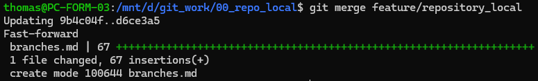
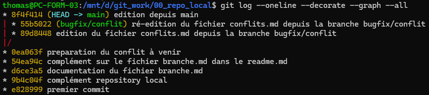

# La gestion des branches

Les branches sont très utiles pour gérer des évolutions et les tester, isoler de nouvelles fonctionnalités ou encore corriger des bugs.

Voici des exemples et des commandes de gestion de branches.

1. Lister les branches

```bash
git branch
```

2. Création d'une nouvelle branche

```bash
git branch "ma_nouvelle_branche"
```

3. Se positionner sur cette nouvelle branche

```bash
git checkout "ma_nouvelle_branch"
```

> Méthode deux en un  (combiné)

```bash
git checkout -b "ma_nouvelle_branche"
```

4. Supression d'une branche
```bash
git branch -d "ma_nouvelle_branche"
```

## Fusion de branche (simple)

Une fois les nouvelles fonctionnalités validés, on va pouvoir fusionner la nouvelle branche à la branche principale.

Les évolutions sur la nouvelle branche concernent la nouvelle branche. Nous nous sommes déplacés sur cette nouvelle branche pour y effectuer les évolutions.

Pour effectuer la fusion des deux branches, nous nous repositionnons à nouveau sur la branche principale.

```bash
git checkout main
```
Nous pouvons à présent effectuer la fusion.

```bash
git merge "ma_nouvelle_branche"
```


Pour garder propre le prepo après la fusion, on peut supprimer la branche.

```bash
git branch -d "ma_nouvelle_branche"
```

## Bonnes pratiques

- **main** : branche principale de production
- **develop** : branche de dévelloppement
- **feature/nom_fonctionnalité** : nouvelle fonctionnalité
- **bugfix/nom_correctif** : correction de bugs

Comme pour les commentaires des commit, il est recommandé de donner une description précise.

## Exercice

Création d'une nouvelle branche et édition d'un fichier **branches.md** qui contient ce descriptif. Finir par la fusion avec la branche principale.

## La cerise sur le giteau

Voir les branches dans la console

```bash
git log --oneline --decorate --graph --all
```

