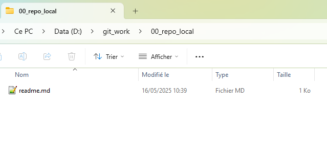
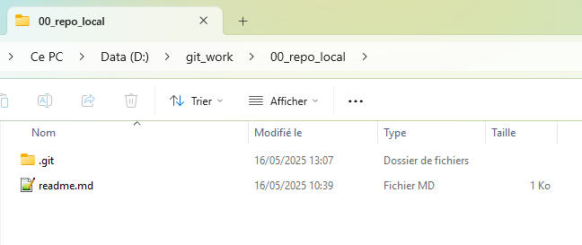
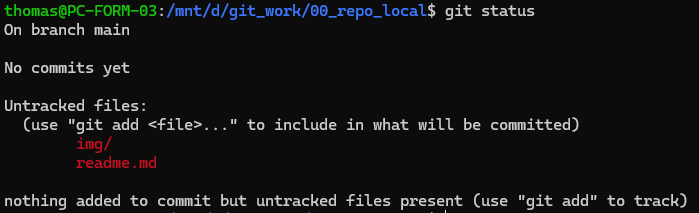
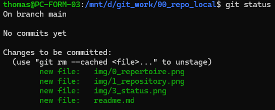
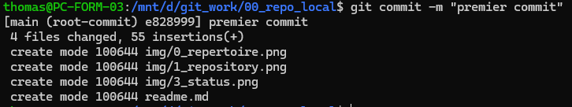

Initiation GIT - Répository Local
---------------

Comment s'auto versionner ? Tout commence par là ... une méthode de travail !

Pourquoi ? ça peut éviter le remplacement inopiné du contenu d'un fichier.

## Etapes

### Préparation du répertoire qui sera trasnformé en repository local

On crée un répertoire vide et on se rend dedans
```bash
mkdir -p 00_repo_local
```
On se positionne dans le répertoire
```bash
cd 00_repo_local
```

> Création de ce fichier Readme.md

```bash
touch readme.md
```

> On édite le readme pour documenter les étapes avec l'éditeur *nano*

```bash
nano readme.md
```
A ce stade nous avons un répertoire classique qui contient un fichier readme.mp

```bash
tree 00_repo_local/
```

> 00_repo_local/
> 
>      |__readme.md



### Configuration du repository local

On configure le répertoire comme un repository git avec la commande : 

```bash
git init
```


Cela crée un dossier .git qui contient tous les fichiers nécessaires à Git pour suivre l'historique.




Notre répertoire est devenu un repository au sens Git de la chose. Il s'agit d'un repository local (sur notre machine).

### Ajoutons les fichier présents au suivi

A ce stade, les premiers fichiers de notre "repo" ne sont pas suivi.

```bash
git status
```



Nous allons ajouter tous les éléments de notre *repo* avec la commande ```git add```

```bash
git add *
```

Tous les éléments de notre repository sont ajouté au suivi, ils sont staggés ou indexés.



### Le commit

On gagne un mot de vocabulaire à placer en soirée ;-)

Le commit consiste a considérer les fichiers comme une version à un instant t et prend en considération un tag ou étiquette qui matérialse par un message au moment du commit avec l'option -m "premier commit" par exemple.

Si l'étape précédente n'a pas été effectuée (aucun élément indexé) la console renverra un message "nothing to commit".

