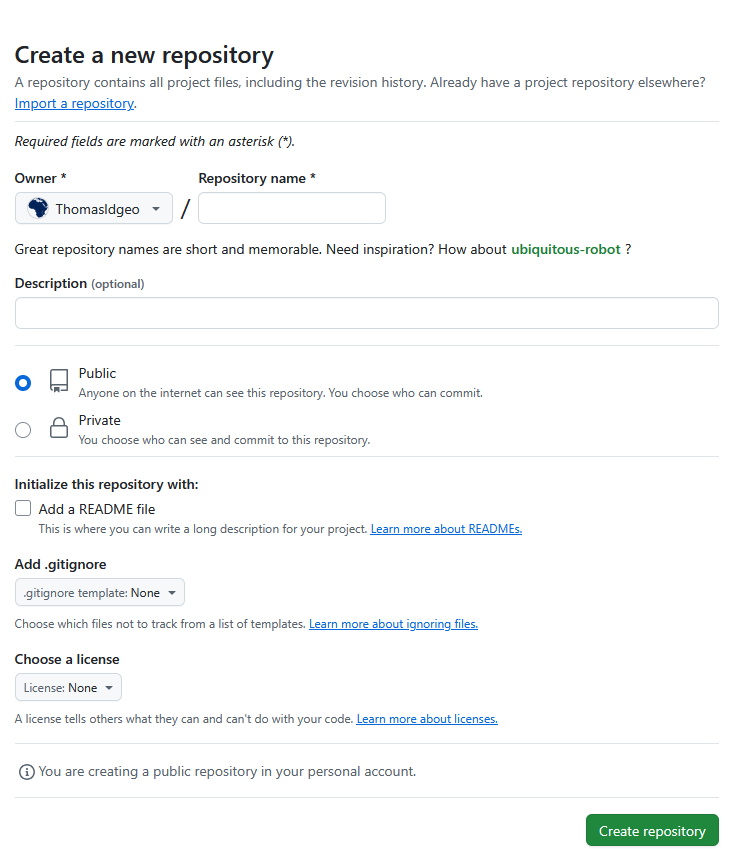

# Création et connexion d'un dépôt distant



A ce stade, nous créons une coquille vide à laquelle nous allons connecter ce repo distant à notre repo local.

1. On initialise le dossier local pour en faire un repo local

```bash
git init
```

On a récupéré le contenu du dossier de démo 00_repo_local, juste ajouté un document repo_distant.md

2. On stagge et on commit

```bash
git add *
```

```bash
git commit -m "on se connecte du local au distant
```

3. On s'assure d'avoir la branch principale qui se nomme main

```bash
git branch -M main
```

4. On connecte au dépôt distant (on le fait une fois)

```bash
git remote add origin https://github.com/ThomasIdgeo/01_repo_distant.git
```

5. On *pousse* le contenu du repo local vers le dépôt distant

```bash
git push -u origin main
```